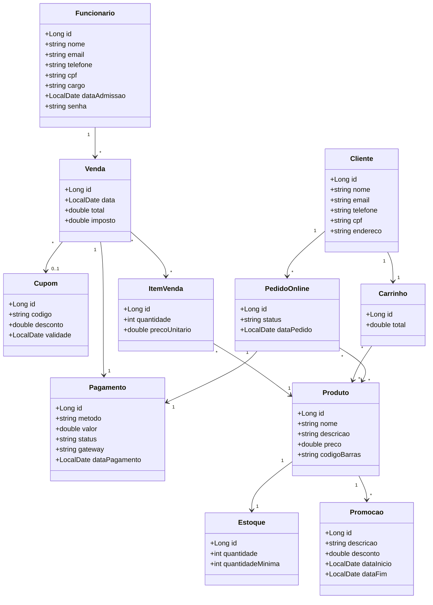

#                         Diagrama de Classes

```mermaid
classDiagram
    class Funcionario {
        +Long id
        +string nome
        +string email
        +string telefone
        +string cpf
        +string cargo
        +LocalDate dataAdmissao
        +string senha
    }

    class Cliente {
        +Long id
        +string nome
        +string email
        +string telefone
        +string cpf
        +string endereco
    }

    class Pagamento {
        +Long id
        +string metodo
        +double valor
        +string status
        +string gateway
        +LocalDate dataPagamento
    }

    class Cupom {
        +Long id
        +string codigo
        +double desconto
        +LocalDate validade
    }

    class Promocao {
        +Long id
        +string descricao
        +double desconto
        +LocalDate dataInicio
        +LocalDate dataFim
    }

    class Venda {
        +Long id
        +LocalDate data
        +double total
        +double imposto
    }

    class ItemVenda {
        +Long id
        +int quantidade
        +double precoUnitario
    }

    class Estoque {
        +Long id
        +int quantidade
        +int quantidadeMinima
    }

    class PedidoOnline {
        +Long id
        +string status
        +LocalDate dataPedido
    }

    class Carrinho {
        +Long id
        +double total
    }

    class Produto {
        +Long id
        +string nome
        +string descricao
        +double preco
        +string codigoBarras
    }

    Funcionario "1" --> "*" Venda
    Cliente "1" --> "*" PedidoOnline
    Cliente "1" --> "1" Carrinho
    Venda "1" --> "1" Pagamento
    Venda "*" --> "*" ItemVenda
    ItemVenda "*" --> "1" Produto
    Produto "1" --> "1" Estoque
    Produto "1" --> "*" Promocao
    Carrinho "*" --> "*" Produto
    PedidoOnline "*" --> "*" Produto
    PedidoOnline "1" --> "1" Pagamento
    Venda "*" --> "0..1" Cupom

```
